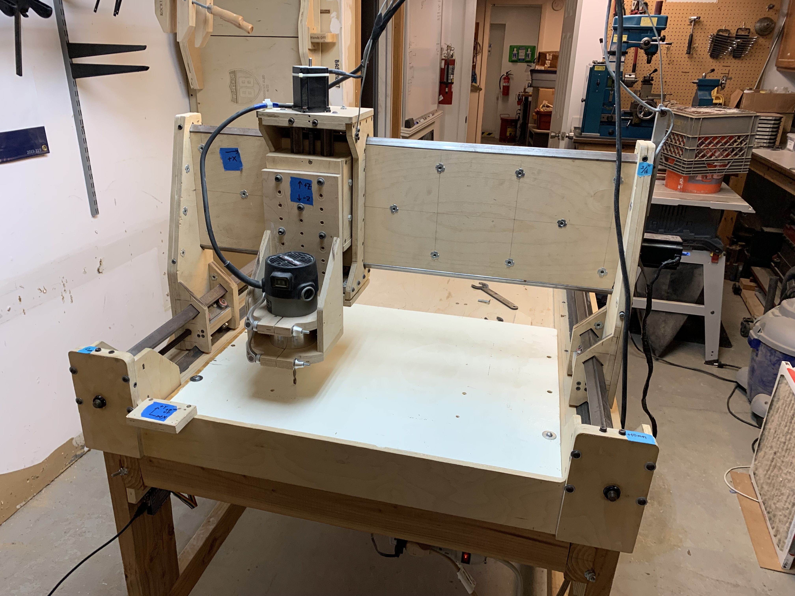
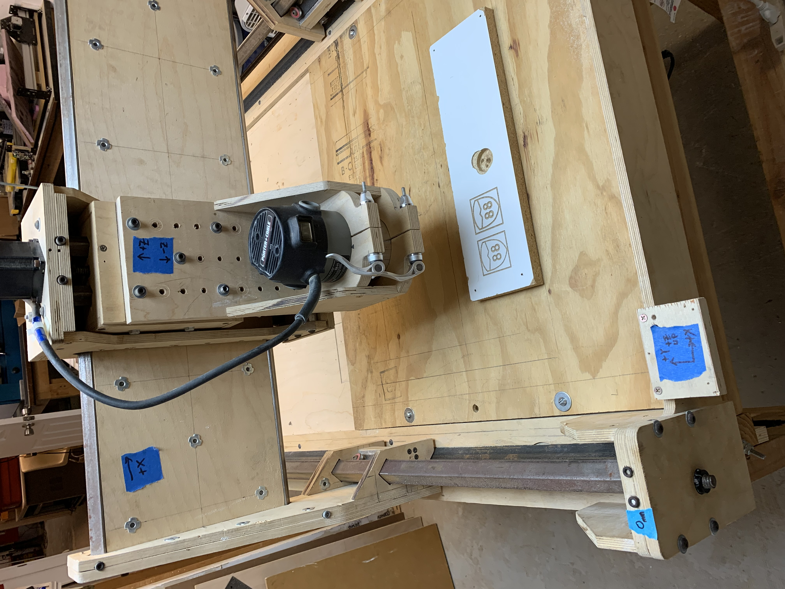

# Camotics Machine Maker
A Python script to create a Camotics CNC Simulator machines from X3D .xhtml files.

## Background

[Camotics](https://camotics.org) is an awesome open source CNC simulator/gcode cut viewer capable of displaying a small variety of consumer machines while simulating machine operations.  Unfortunately, [Camotics](https://camotics.org) lacks native tools/interfaces to import your own machine designs. 
(See:[https://github.com/CauldronDevelopmentLLC/CAMotics/issues/403](https://github.com/CauldronDevelopmentLLC/CAMotics/issues/403))

I wanted to create a model of a wooden CNC machine at my local makerspace [Workshop 88](https://blog.workshop88.com/) for use in [Camotics](https://camotics.org) but there is no built into the program to make additional machines so I hacked this Python script together to read X3D .xhtml files I create in [FreeCAD](https://www.freecad.org/) and write the necessary files for [Camotics](https://camotics.org).
 

The machine files have the same filenames as their names in [Camotics](https://camotics.org) making them easy to find in the file system.  In Windows I found mine in *C:\Program Files (x86)\CAMotics\machines*, which requires Administrator privelege to access.  Machines are defined by two files, a .json file describing the machine and its parts, and a corresponding proprietary .tco file containing geometry for all the parts (points, lines, triangles).  Both files are text and were straight forward to reverse engineer.

I chose [X3D .xhtml](https://en.wikipedia.org/wiki/X3D) as the input format because it contains triangles ***and*** edges (unlike [STL](https://en.wikipedia.org/wiki/STL_(file_format))), it is XML based, and it is visible in a browser to verify correct output from [FreeCAD](https://www.freecad.org/).  I think any .xhtml file should work from any source so long as the parts of the machines are separate *Shape*s (though too many *Shape*s may be unwieldly to configure).  Unfortunately X3D .xhtml is an extremely flexible format with deeply nested groups of elements and some referencing resulting in a script that may *"work on my machine"* or *"work on my file"* and maybe not yours, though I did my best to make it general purpose and document the code should you try to extend/repair it. 

## Usage
`python camotics_machine_maker.py filespec.xhtml`

This will parse `filespec.xhtml` then generate `filespec.json`, and `filespec.tco` in the same location as `filespec.xhtml`.  The script will silently overwrite preexisting files.

**Note:** `filespec.json` will require additional manual editing to tell [Camotics](https://camotics.org) which components move with X, Y, and Z movement of the tool in the simulated gcode.  See [/example/data/Camotics](/example/data/Camotics/README.md) for detailed instructions.

## Installation
To install a machine in [Camotics](https://camotics.org):
1. Copy your `.json` and `.tco` files to the directory containing the other [Camotics](https://camotics.org) machines.  On my Windows machine that is*C:\Program Files (x86)\CAMotics\machines* which will require Administrator privileges.  
2. Start (or restart) [Camotics](https://camotics.org).
3. Be sure to enable `Toggle Machine Display` 
4. Go to `Settings` from the `tools` menu 
5. Select your machine from the dropdown list and click `Save` 
6. Test your machine by running the default or your own gcode to verify the parts are moving correctly and iterate if necessary.

## Examples
* [Workshop 88 Wooden CNC FreeCAD source files](Example/FreeCAD)

* [Workshop 88 Wooden CNC exported at .xhtml with the output of the script](example/data)

* [Output files modified for correct motion](/example/data/Camotics)

# I hope it works for you!
I can't wait to see machines like [MPCNC](https://docs.v1e.com/mpcnc/intro/), and silly stuff like Hello Kitty, and NutterButter CNC machines crazy internet people make for [Camotics](https://camotics.org)!
